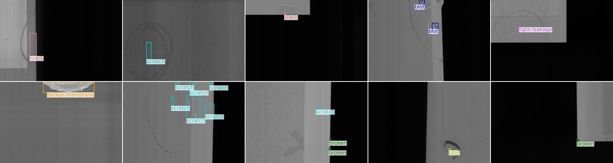
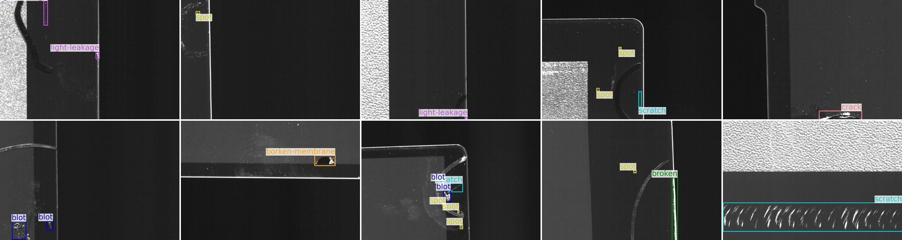

# SSGD: A SMARTPHONE SCREEN GLASS DATASET FOR DEFECT DETECTION

<!--  -->
####  [Paper (ArXiv)](https://arxiv.org/pdf/2303.06673.pdf) | [Results](./RESULT.md) | [Download(Baidu)]( https://pan.baidu.com/s/1Il2t5B0ns4SO8_HwTsmtKw?pwd=sted ) | [Download(TsinghuaCloud)](https://cloud.tsinghua.edu.cn/f/720250d21e1b4887abf7/?dl=1)


### SSGD
- For screen glass defect detection
- 2,504 annotated images and 3,914 defects
- Seven types of defects: **crack**, **broken**, **spot**, **scratch**, **light-leakage**, **blot**, **broken-membrane**

### Usage
This dataset is allowed for **academic purposes only**. We recommend that researchers use **5-fold cross-validation** to conduct experiments on SSGD.

### Dependency
We mainly depend [pytorch](https://pytorch.org/get-started/locally/), [timm](https://github.com/huggingface/pytorch-image-models) and [mmdetection](https://github.com/open-mmlab/mmdetection):
```
pip install torch==1.7.1+cu110 torchvision==0.8.2+cu110 torchaudio==0.7.2 -f https://download.pytorch.org/whl/torch_stable.html
pip install timm==0.3.2
pip install mmcv-full==1.3.17 -f https://download.openmmlab.com/mmcv/dist/cu110/torch1.7/index.html
pip install mmdet==2.25.0
```
After downloading the [dataset](https://cloud.tsinghua.edu.cn/f/0a03abd18c0f4038a9c4/?dl=1), you should put it into ```./data/defect_scree```.

### Citation

```
@inproceedings{SSGD,
  author    = {Haonan Han and
               Rui Yang and
               Shuyan Li and
               Runze Hu and
               Xiu Li},
  title     = {SSGD: A smartphone screen glass dataset for defect detection.},
  booktitle = {ICASSP},
  year      = {2023}
}
```
